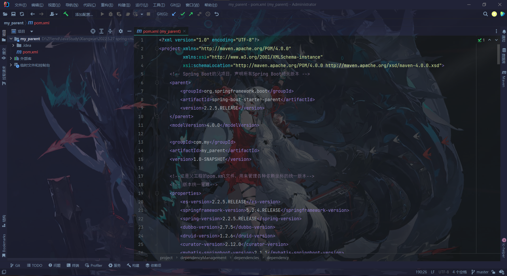

# JavaEE学习笔记

用来记录自己学习 JavaWeb 以及 JavaEE 中比较重要的知识点，以及用来整理学习过程中自己码的代码，方便回顾和查阅。

## JDBC

[什么是JDBC？这篇文章告诉你 - 知乎 (zhihu.com)](https://zhuanlan.zhihu.com/p/140885502)

JDBC基本模板：

### jdbc.properties:

```properties
driverClass=com.mysql.jdbc.Driver
url=jdbc:mysql://localhost:3306/student?serverTimezone=Asia/Shanghai&useUnicode=true&characterEncoding=utf8&useSSL=false
userName=root
password=030212
```

用来存储数据库的url和对应数据库的username和password

## JavaWeb

### xml

### http协议

### Tomcat

### Servlet

### Cookies

### Session

### ServletContext

### JSP

### EL表达式

### JSql标签库

### Ajax

### 监听器

### 过滤器

### JWT

[(95条消息) SpringBoot集成JWT实现token验证_苍穹帝的博客-CSDN博客_springboot集成jwt](https://blog.csdn.net/gjtao1130/article/details/111658060)

## Vue.js

### 动态监视页面分辨率变化

[(94条消息) Vue如何监视屏幕尺寸变化_qq_47452289的博客-CSDN博客_vue监听屏幕大小变化](https://blog.csdn.net/qq_47452289/article/details/112461808)

### 背景插件

[(95条消息) 炫酷的动态粒子背景效果(vue专属)_吴英琦的博客-CSDN博客_vue 炫酷背景](https://blog.csdn.net/weixin_49356003/article/details/117662403?spm=1001.2101.3001.6650.4&utm_medium=distribute.pc_relevant.none-task-blog-2%7Edefault%7ECTRLIST%7Edefault-4-117662403-blog-107782737.pc_relevant_multi_platform_whitelistv2_ad_hc&depth_1-utm_source=distribute.pc_relevant.none-task-blog-2%7Edefault%7ECTRLIST%7Edefault-4-117662403-blog-107782737.pc_relevant_multi_platform_whitelistv2_ad_hc)

### 使用路由守卫 + vuex实现前端路由权限控

[(95条消息) 使用路由守卫 + vuex实现前端路由权限控制_qq_42373684的博客-CSDN博客](https://blog.csdn.net/qq_42373684/article/details/105959048)

### 从0动态滚动到指定数字

[(96条消息) vue-animate-number插件（从0动态滚动到指定数字）_一只程序猿小白的博客-CSDN博客_vue-animate-number](https://blog.csdn.net/qq_42540989/article/details/107410050)

### 实时刷新页面数据

[vue实时刷新页面数据 - 张新钢 - 博客园 (cnblogs.com)](https://www.cnblogs.com/zxg-code/p/13972696.html)

### 解决父级路由不需要 component的情况

[(97条消息) 【Vue-router】解决父级路由不需要 component的情况_songywaa的博客-CSDN博客](https://blog.csdn.net/weixin_42288182/article/details/115176711)

## element-ui

### 抽屉式菜单切换时自动关闭的方法

[(95条消息) element ui 手动关闭Drawer抽屉组件的方法_whitexxxkkk的博客-CSDN博客_el-drawer关闭](https://blog.csdn.net/qq_46239972/article/details/116356454)

```html
<template>  
    <el-drawer ref="navDrawer">
      <el-menu @select="menuActive">
      </el-menu>
    </el-drawer>
</template>
<script>
export default {
  methods: {
    /*  用于在点击时关闭抽屉  */
    menuActive() {
      this.$refs.navDrawer.closeDrawer()
    }
  }
}
</script>
```

### Tag标签实现路由导航

[(95条消息) Vue实现tab页多页面切换_皮蛋solo周呀的博客-CSDN博客_vue切换页面](https://blog.csdn.net/weixin_44590591/article/details/124866869?spm=1001.2101.3001.6650.8&utm_medium=distribute.pc_relevant.none-task-blog-2%7Edefault%7EBlogCommendFromBaidu%7Edefault-8-124866869-blog-120182616.pc_relevant_multi_platform_whitelistv1&depth_1-utm_source=distribute.pc_relevant.none-task-blog-2%7Edefault%7EBlogCommendFromBaidu%7Edefault-8-124866869-blog-120182616.pc_relevant_multi_platform_whitelistv1)

### 面包屑式动态路由实现

```html
<template>  
<!--    路由导航-->
    <div>
      <el-breadcrumb separator-class="el-icon-arrow-right">
        <el-breadcrumb-item
            v-for="(item,index) in breadList"
            :key="index"
        >{{ item.name }}
        </el-breadcrumb-item>
      </el-breadcrumb>
    </div>
</template>
<script>
expert default{
  name: '',
  data() {
    return {
      breadList: [], // 路由集合
    };
  },
  watch: {
    $route() {
      this.getBreadcrumb();
    }
  },  methods: {
    isHome(route) {
      return route.name === "首页";
    },
    getBreadcrumb() {
      let matched = this.$route.matched;
      //如果不是首页
      if (!this.isHome(matched[0])) {
         matched = [{path: "/home", name: '首页'}].concat(matched);
      }
      this.breadList = matched;
    },
  }
}
</script>
```

### el-tree获取未全选中子节点的父节点id

[(97条消息) element-ui避坑: el-tree控件中子节点未全部选中，提交树形数据时，父节点id没有选中并获取。_码善豪的博客-CSDN博客](https://blog.csdn.net/qq_29540337/article/details/105067149?spm=1001.2101.3001.6650.1&utm_medium=distribute.pc_relevant.none-task-blog-2%7Edefault%7ECTRLIST%7Edefault-1-105067149-blog-87193276.pc_relevant_aa_2&depth_1-utm_source=distribute.pc_relevant.none-task-blog-2%7Edefault%7ECTRLIST%7Edefault-1-105067149-blog-87193276.pc_relevant_aa_2)

## MyBatis

### 从 XML 中构建 SqlSessionFactory

每个基于 MyBatis 的应用都是以一个 SqlSessionFactory 的实例为核心的。SqlSessionFactory 的实例可以通过 SqlSessionFactoryBuilder 获得。而 SqlSessionFactoryBuilder 则可以从 XML 配置文件或一个预先配置的 Configuration 实例来构建出 SqlSessionFactory 实例。

从 XML 文件中构建 SqlSessionFactory 的实例非常简单，建议使用类路径下的资源文件进行配置。 但也可以使用任意的输入流（InputStream）实例，比如用文件路径字符串或 file:// URL 构造的输入流。MyBatis 包含一个名叫 Resources 的工具类，它包含一些实用方法，使得从类路径或其它位置加载资源文件更加容易。

```java
String resource = "org/mybatis/example/mybatis-config.xml";
InputStream inputStream = Resources.getResourceAsStream(resource);
SqlSessionFactory sqlSessionFactory = new SqlSessionFactoryBuilder().build(inputStream);
```

XML 配置文件中包含了对 MyBatis 系统的核心设置，包括获取数据库连接实例的数据源（DataSource）以及决定事务作用域和控制方式的事务管理器（TransactionManager）。后面会再探讨 XML 配置文件的详细内容，这里先给出一个简单的示例：

```xml
<?xml version="1.0" encoding="UTF-8" ?>
<!DOCTYPE configuration
  PUBLIC "-//mybatis.org//DTD Config 3.0//EN"
  "http://mybatis.org/dtd/mybatis-3-config.dtd">
<configuration>
  <environments default="development">
    <environment id="development">
      <transactionManager type="JDBC"/>
      <dataSource type="POOLED">
        <property name="driver" value="${driver}"/>
        <property name="url" value="${url}"/>
        <property name="username" value="${username}"/>
        <property name="password" value="${password}"/>
      </dataSource>
    </environment>
  </environments>
  <mappers>
    <mapper resource="org/mybatis/example/BlogMapper.xml"/>
  </mappers>
</configuration>
```

当然，还有很多可以在 XML 文件中配置的选项，上面的示例仅罗列了最关键的部分。 注意 XML 头部的声明，它用来验证 XML 文档的正确性。environment 元素体中包含了事务管理和连接池的配置。mappers 元素则包含了一组映射器（mapper），这些映射器的 XML 映射文件包含了 SQL 代码和映射定义信息。

### 探究已映射的 SQL 语句

现在你可能很想知道 SqlSession 和 Mapper 到底具体执行了些什么操作，但 SQL 语句映射是个相当广泛的话题，可能会占去文档的大部分篇幅。 但为了让你能够了解个大概，这里会给出几个例子。

在上面提到的例子中，一个语句既可以通过 XML 定义，也可以通过注解定义。我们先看看 XML 定义语句的方式，事实上 MyBatis 提供的所有特性都可以利用基于 XML 的映射语言来实现，这使得 MyBatis 在过去的数年间得以流行。如果你用过旧版本的 MyBatis，你应该对这个概念比较熟悉。 但相比于之前的版本，新版本改进了许多 XML 的配置，后面我们会提到这些改进。这里给出一个基于 XML 映射语句的示例，它应该可以满足上个示例中 SqlSession 的调用。

```xml
<?xml version="1.0" encoding="UTF-8" ?>
<!DOCTYPE mapper
  PUBLIC "-//mybatis.org//DTD Mapper 3.0//EN"
  "http://mybatis.org/dtd/mybatis-3-mapper.dtd">
<mapper namespace="org.mybatis.example.BlogMapper">
  <select id="selectBlog" resultType="Blog">
    select * from Blog where id = #{id}
  </select>
</mapper>
```

## MyBatis-Plus

### 代码生成器

官网：[代码生成器（新） | MyBatis-Plus (baomidou.com)](https://baomidou.com/pages/779a6e/#%E5%BF%AB%E9%80%9F%E5%85%A5%E9%97%A8)

CSDN：[Mybatis-Plus自动生成代码，自定义Controller_程序员青戈的博客-CSDN博客_mybatisplus的controller](https://blog.csdn.net/xqnode/article/details/122704540?ops_request_misc=%257B%2522request%255Fid%2522%253A%2522165786522716781647528118%2522%252C%2522scm%2522%253A%252220140713.130102334.pc%255Fblog.%2522%257D&request_id=165786522716781647528118&biz_id=0&utm_medium=distribute.pc_search_result.none-task-blog-2~blog~first_rank_ecpm_v1~rank_v31_ecpm-2-122704540-null-null.185^v2^control&utm_term=%E4%BB%A3%E7%A0%81%E7%94%9F%E6%88%90%E5%99%A8&spm=1018.2226.3001.4450)

#### Generator.java模板代码：

```java
package com.jixiebackstage.springboot.utils;

import com.baomidou.mybatisplus.generator.FastAutoGenerator;
import com.baomidou.mybatisplus.generator.config.OutputFile;

import java.util.Collections;

/**
 * mybatis-plus
 * 代码生成器
 */
public class Generator {

    public static void main(String[] args) {
        generate();
    }

    private static void generate() {
        FastAutoGenerator.create("jdbc:mysql://localhost:3306/jixiedatabase?serverTimezone=UTC&useUnicode=true&characterEncoding=utf8&useSSL=false",
                        "root", "030212")
                .globalConfig(builder -> {
                    builder.author("邹永靖") // 设置作者
                            .enableSwagger() // 开启 swagger 模式
                            .fileOverride() // 覆盖已生成文件
                            .outputDir("D:\\ZFiend\\Project\\JiXieWeb\\SpringBoot\\src\\main\\java\\"); // 指定输出目录
                })
                .packageConfig(builder -> {
                    builder.parent("com.jixiebackstage.springboot") // 设置父包名
                            .moduleName(null) // 设置父包模块名
                            .pathInfo(Collections.singletonMap(OutputFile.mapperXml, "D:\\ZFiend\\Project\\JiXieWeb" +
                                    "\\SpringBoot\\src\\main\\resources\\mapper\\")); // 设置mapperXml生成路径
                })
                .strategyConfig(builder -> {
                    builder.entityBuilder().enableLombok(); //  提供lombok
                    builder.controllerBuilder().enableHyphenStyle()  // 开启驼峰转连字符
                            .enableRestStyle();  // 开启生成@RestController 控制器
                    builder.addInclude("sys_user") // 设置需要生成的表名
                            .addTablePrefix("t_", "sys_"); // 设置过滤表前缀
                })
//                .templateEngine(new FreemarkerTemplateEngine()) // 使用Freemarker引擎模板，默认的是Velocity引擎模板
                .execute();
    }
}

```

#### controller.java.vm代码模板

（用于生成controller模板增删改查代码）:

```java
package ${package.Controller};

import com.baomidou.mybatisplus.core.conditions.query.QueryWrapper;
import com.baomidou.mybatisplus.extension.plugins.pagination.Page;
import org.springframework.web.bind.annotation.*;
import org.springframework.stereotype.Controller;

import javax.annotation.Resource;
import java.util.List;

import $!{package.Service}.$!{table.serviceName};
import ${package.Entity}.${entity};

#if(${superControllerClassPackage})
import ${superControllerClassPackage};
#end

/**
 * <p>
 * $!{table.comment} 前端控制器
 * </p>
 *
 * @author ${author}
 * @since ${date}
 */
#if(${restControllerStyle})
@RestController
#else
@Controller
#end
@RequestMapping("#if(${package.ModuleName})/${package.ModuleName}#end/#if(${controllerMappingHyphenStyle})${controllerMappingHyphen}#else${table.entityPath}#end")
#if(${kotlin})
class ${table.controllerName}#if(${superControllerClass}) : ${superControllerClass}()#end

#else
    #if(${superControllerClass})
    public class ${table.controllerName} extends ${superControllerClass} {
    #else
    public class ${table.controllerName} {
    #end

@Resource(name = "${table.entityPath}ServiceImpl")
private ${table.serviceName} ${table.entityPath}Service;

@PostMapping
public Boolean save(@RequestBody ${entity} ${table.entityPath}){
        return ${table.entityPath}Service.saveOrUpdate(${table.entityPath});
        }

@DeleteMapping("/{id}")
public Boolean delete(@PathVariable Integer id){
        return ${table.entityPath}Service.removeById(id);
        }

@PostMapping("/del/batch")
public Boolean deleteBatch(@RequestBody List<Integer> ids){
        return ${table.entityPath}Service.removeByIds(ids);
        }

@GetMapping
public List<${entity}> findAll(){
        return ${table.entityPath}Service.list();
        }

@GetMapping("/{id}")
public List<${entity}> findOne(@PathVariable Integer id){
        return ${table.entityPath}Service.list();
        }

@GetMapping("/page")
public Page<${entity}> findPage(@RequestParam Integer pageNum,
@RequestParam Integer pageSize){
        QueryWrapper<User> queryWrapper=new QueryWrapper<>();
        queryWrapper.orderByDesc("id");
        return ${table.entityPath}Service.page(new Page<>(pageNum,pageSize),queryWrapper);
        }

        }

#end

```

## Spring

## SpringMVC

## SpringBoot

### Jwt拦截器

同上：

[(95条消息) SpringBoot集成JWT实现token验证_苍穹帝的博客-CSDN博客_springboot集成jwt](https://blog.csdn.net/gjtao1130/article/details/111658060)

## Maven

### 统一父类项目管理

利用pom.xml文件对所有同组spring项目设置父类管理，模板案例：



pom.xml模板内容：

```xml
<?xml version="1.0" encoding="UTF-8"?>
<project xmlns="http://maven.apache.org/POM/4.0.0"
         xmlns:xsi="http://www.w3.org/2001/XMLSchema-instance"
         xsi:schemaLocation="http://maven.apache.org/POM/4.0.0 http://maven.apache.org/xsd/maven-4.0.0.xsd">
    <!-- Spring Boot的父项目，声明所有Spring Boot相关版本 -->
    <parent>
        <groupId>org.springframework.boot</groupId>
        <artifactId>spring-boot-starter-parent</artifactId>
        <version>2.2.5.RELEASE</version>
    </parent>
    <modelVersion>4.0.0</modelVersion>

    <groupId>com.my</groupId>
    <artifactId>my_parent</artifactId>
    <version>1.0-SNAPSHOT</version>

    <!--这是父工程的pom.xml文件，用来管理各种依赖坐标的统一版本-->
    <!-- 版本统一管理-->
    <properties>
        <es-version>2.2.5.RELEASE</es-version>
        <springframework-version>5.2.4.RELEASE</springframework-version>
        <spring-version>2.2.5.RELEASE</spring-version>
        <dubbo-version>2.7.5</dubbo-version>
        <druid-version>1.2.6</druid-version>
        <curator-version>2.12.0</curator-version>
        <mybatis-springboot-version>2.1.1</mybatis-springboot-version>
        <mysql-driver-version>5.1.48</mysql-driver-version>
        <jstl-version>1.2</jstl-version>
        <tomcat-jsp-version>9.0.31</tomcat-jsp-version>
        <druid-springboot-version>1.1.10</druid-springboot-version>
        <pagehelper-springboot-version>1.2.13</pagehelper-springboot-version>
        <page-version>5.1.11</page-version>
        <common-lang3-version>3.4</common-lang3-version>
        <httpclient-version>4.5.10</httpclient-version>
        <jackson-version>2.10.3</jackson-version>
        <servlet-version>4.0.1</servlet-version>
        <spring-session-version>2.2.2.RELEASE</spring-session-version>
        <commons-net-version>3.6</commons-net-version>
        <junit-version>4.13.2</junit-version>
        <fileupload-version>1.3.3</fileupload-version>
        <spring-boot-test-version>2.2.5.RELEASE</spring-boot-test-version>
        <project-lombok>1.18.22</project-lombok>
    </properties>
    <!-- 依赖管理，在父项目中声明，子项目添加依赖时不需要有version，所有版本都由父项目进行统一管理 -->
    <dependencyManagement>
        <dependencies>
            <!-- Spring Session 分布式事务 ，在登录时使用 -->
            <dependency>
                <groupId>org.springframework.session</groupId>
                <artifactId>spring-session-data-redis</artifactId>
                <version>${spring-session-version}</version>
            </dependency>
            <!-- spring-session -->
            <dependency>
                <groupId>org.springframework.session</groupId>
                <artifactId>spring-session-core</artifactId>
                <version>${spring-session-version}</version>
            </dependency>
            <dependency>
                <groupId>org.springframework.boot</groupId>
                <artifactId>spring-boot-starter</artifactId>
                <version>${spring-version}</version>
            </dependency>
            <dependency>
                <groupId>org.springframework.boot</groupId>
                <artifactId>spring-boot-starter-web</artifactId>
                <version>${spring-version}</version>
            </dependency>
            <!-- dubbo -->
            <dependency>
                <groupId>org.apache.dubbo</groupId>
                <artifactId>dubbo-spring-boot-starter</artifactId>
                <version>${dubbo-version}</version>
            </dependency>
            <dependency>
                <groupId>org.apache.curator</groupId>
                <artifactId>curator-recipes</artifactId>
                <version>${curator-version}</version>
            </dependency>
            <dependency>
                <groupId>org.apache.curator</groupId>
                <artifactId>curator-framework</artifactId>
                <version>${curator-version}</version>
            </dependency>
            <!-- mybatis-->
            <dependency>
                <groupId>org.mybatis.spring.boot</groupId>
                <artifactId>mybatis-spring-boot-starter</artifactId>
                <version>${mybatis-springboot-version}</version>
            </dependency>
            <!-- druid连接池-->
            <dependency>
                <groupId>com.alibaba</groupId>
                <artifactId>druid-spring-boot-starter</artifactId>
                <version>${druid-springboot-version}</version>
            </dependency>
            <!-- 数据库驱动-->
            <dependency>
                <groupId>mysql</groupId>
                <artifactId>mysql-connector-java</artifactId>
                <version>${mysql-driver-version}</version>
            </dependency>
            <!-- jsp解析器 -->
            <dependency>
                <groupId>javax.servlet</groupId>
                <artifactId>jstl</artifactId>
                <version>${jstl-version}</version>
            </dependency>

            <dependency>
                <groupId>org.apache.tomcat.embed</groupId>
                <artifactId>tomcat-embed-jasper</artifactId>
                <scope>provided</scope>
                <version>${tomcat-jsp-version}</version>
            </dependency>

            <!-- pagehelper分页插件下面两个都要  -->
            <dependency>
                <groupId>com.github.pagehelper</groupId>
                <artifactId>pagehelper-spring-boot-starter</artifactId>
                <version>${pagehelper-springboot-version}</version>
            </dependency>

            <dependency>
                <groupId>com.github.pagehelper</groupId>
                <artifactId>pagehelper</artifactId>
                <version>${page-version}</version>
            </dependency>

            <dependency>
                <groupId>org.apache.commons</groupId>
                <artifactId>commons-lang3</artifactId>
                <version>${common-lang3-version}</version>
            </dependency>
            <!-- elasticsearch-->
            <dependency>
                <groupId>org.springframework.boot</groupId>
                <artifactId>spring-boot-starter-data-elasticsearch</artifactId>
                <version>${es-version}</version>
            </dependency>
            <!-- redis-->
            <dependency>
                <groupId>org.springframework.boot</groupId>
                <artifactId>spring-boot-starter-data-redis</artifactId>
                <version>${spring-version}</version>
            </dependency>

            <!-- rabbitmq-->
            <dependency>
                <groupId>org.springframework.boot</groupId>
                <artifactId>spring-boot-starter-amqp</artifactId>
                <version>${spring-version}</version>
            </dependency>

            <!-- httpclient-->
            <dependency>
                <groupId>org.apache.httpcomponents</groupId>
                <artifactId>httpclient</artifactId>
                <version>${httpclient-version}</version>
            </dependency>

            <!-- 文件上传组件 -->
            <dependency>
                <groupId>commons-fileupload</groupId>
                <artifactId>commons-fileupload</artifactId>
                <version>${fileupload-version}</version>
            </dependency>
            <!-- jackson-->
            <dependency>
                <groupId>com.fasterxml.jackson.core</groupId>
                <artifactId>jackson-databind</artifactId>
                <version>${jackson-version}</version>
            </dependency>
            <dependency>
                <groupId>commons-net</groupId>
                <artifactId>commons-net</artifactId>
                <version>${commons-net-version}</version>
            </dependency>


            <dependency>
                <groupId>com.alibaba</groupId>
                <artifactId>druid</artifactId>
                <version>${druid-version}</version>
                <scope>compile</scope>
            </dependency>
            <dependency>
                <groupId>org.springframework</groupId>
                <artifactId>spring-jcl</artifactId>
            </dependency>
            <!-- servlet-->
            <dependency>
                <groupId>javax.servlet</groupId>
                <artifactId>javax.servlet-api</artifactId>
                <version>${servlet-version}</version>
                <scope>provided</scope>
            </dependency>
            <dependency>
                <groupId>org.springframework</groupId>
                <artifactId>spring-web</artifactId>
                <version>${springframework-version}</version>
            </dependency>
            <!-- java mail -->
            <dependency>
                <groupId>org.springframework.boot</groupId>
                <artifactId>spring-boot-starter-mail</artifactId>
                <version>${spring-version}</version>
            </dependency>
            <!-- 视图模板技术 -->
            <dependency>
                <groupId>org.springframework.boot</groupId>
                <artifactId>spring-boot-starter-freemarker</artifactId>
                <version>${spring-version}</version>
            </dependency>
            <!--单元测试-->
            <dependency>
                <groupId>junit</groupId>
                <artifactId>junit</artifactId>
                <version>${junit-version}</version>
                <scope>test</scope>
            </dependency>
            <dependency>
                <groupId>org.springframework.boot</groupId>
                <artifactId>spring-boot-starter-test</artifactId>
                <scope>test</scope>
                <version>${spring-boot-test-version}</version>
            </dependency>
            <dependency>
                <groupId>org.projectlombok</groupId>
                <artifactId>lombok</artifactId>
                <version>${project-lombok}</version>
                <scope>provided</scope>
            </dependency>

        </dependencies>
    </dependencyManagement>
    <build>
        <!--插件管理-->
        <pluginManagement>
            <plugins>
                <plugin>
                    <groupId>org.springframework.boot</groupId>
                    <artifactId>spring-boot-maven-plugin</artifactId>
                    <configuration>
                        <fork>true</fork>
                    </configuration>
                </plugin>
            </plugins>
        </pluginManagement>
    </build>

</project>

```
