# sqMySQL学习笔记

## 1-数据库介绍

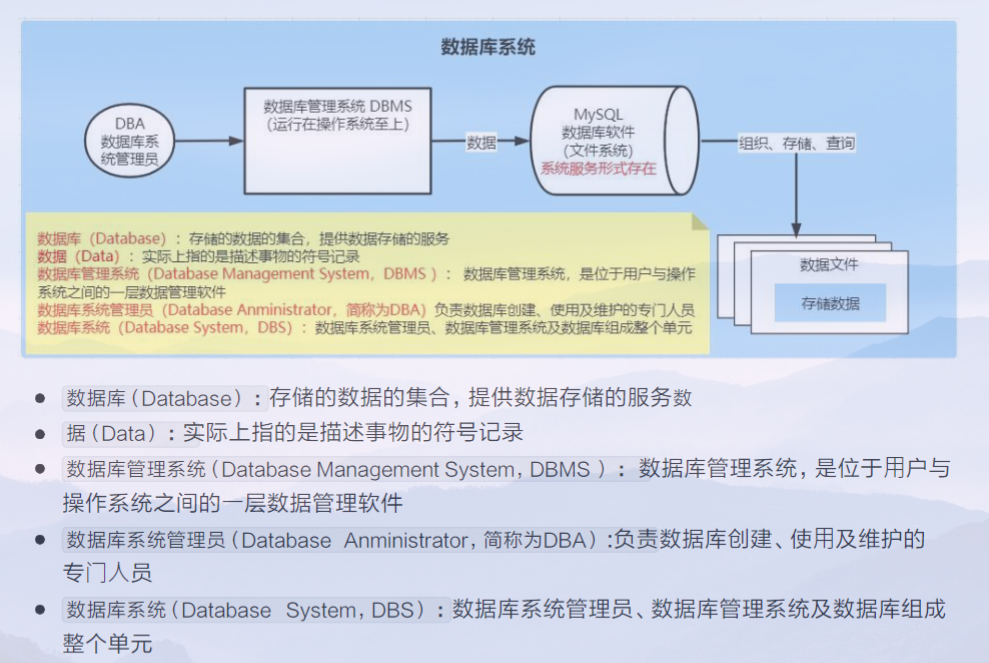

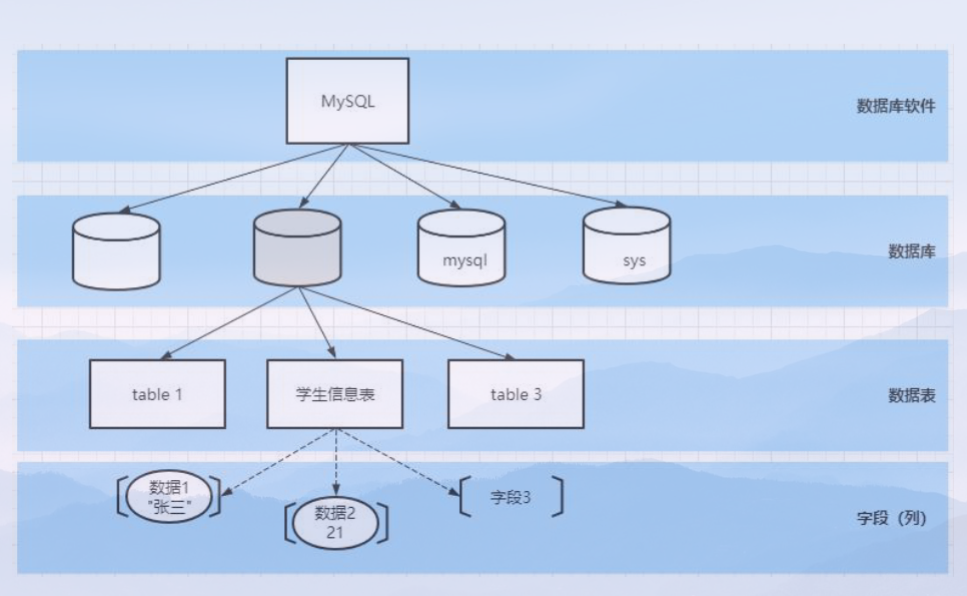

## 2-DDL数据定义语言

### 2.1-DDL-操作数据库

```sql
## DDL数据库操作
## 创建数据库
CREATE DATABASE test01;

## 当指定名称不存在时创建数据库
CREATE DATABASE if not EXISTS xiangxuestudy;

## 创建数据库同时指定字符集
CREATE DATABASE if not EXISTS xiangxue CHARACTER set utf8;

## 修改数据库字符集
ALTER DATABASE xiangxuestudy character set utf8;

## 删除数据库
DROP DATABASE if EXISTS xiangxue;

## 切换数据库
use xiangxue;
use xiangxuestudy;

```

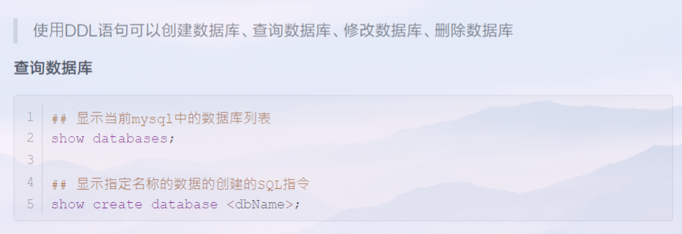

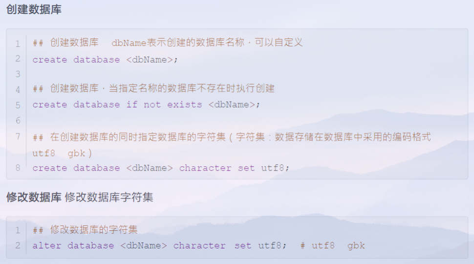

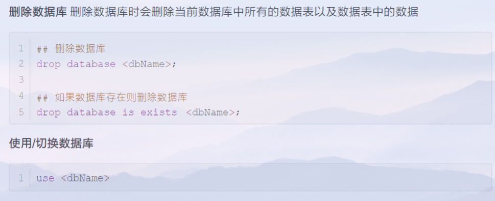

### 2.2-DDL-操作数据表

```sql
## DDL数据表操作
## 创建数据表
CREATE TABLE students(
	stu_num char(8) not null UNIQUE,
	stu_name varchar(20) not null,
	stu_gender char(2) not null,
	stu_age int not null,
	stu_tel char(11) not null unique,
	stu_qq varchar(11) unique
);

CREATE TABLE test(
	demo01 int not null
);

## 查询数据表
show TABLES;

## 查询表结构
DESC students;

## 删除数据表
DROP TABLE if EXISTS test;

## 修改数据表
## 修改表名
ALTER TABLE test RENAME to Test;

## 修改字符集
ALTER TABLE test CHARACTER set utf8;

## 添加字段（列）
ALTER TABLE test add new VARCHAR(200);

## 修改字段的列表和类型
ALTER TABLE test change new old int;

## 只修改字段的类型
ALTER TABLE test MODIFY old VARCHAR(200);

## 删除列
ALTER TABLE test DROP old;


```

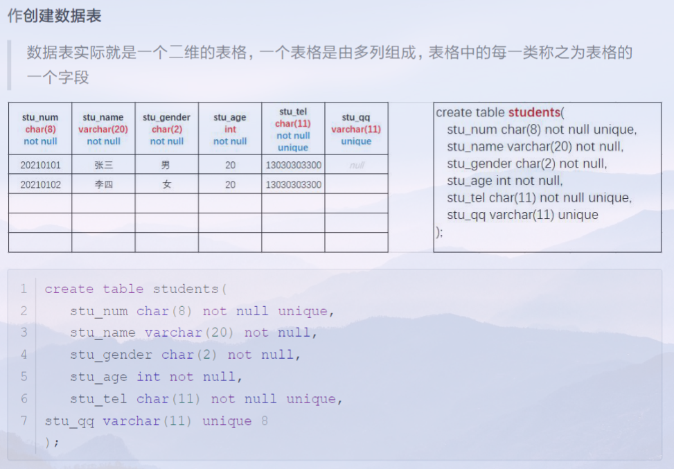


## 3-MySQL数据类型

### 3.1-数值类型

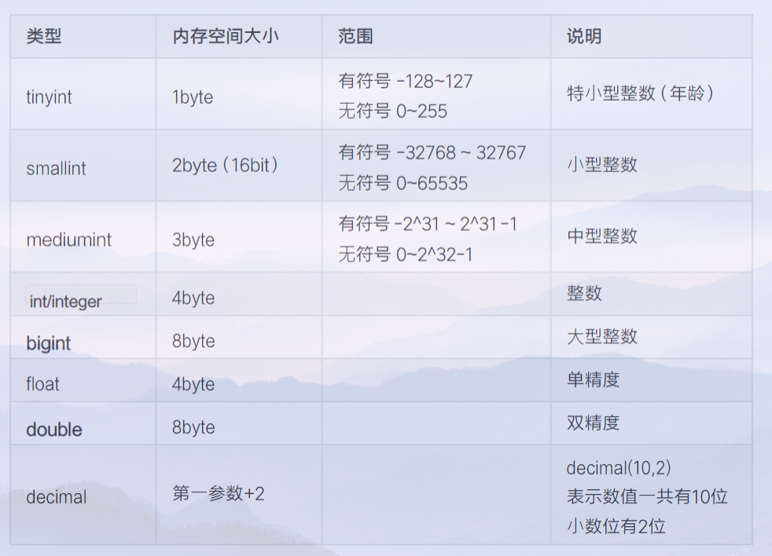

### 3.2-字符串类型

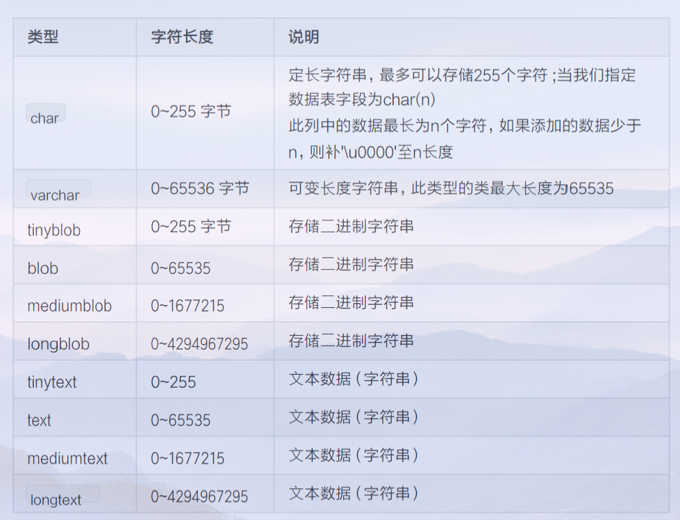

### 3.3-日期类型

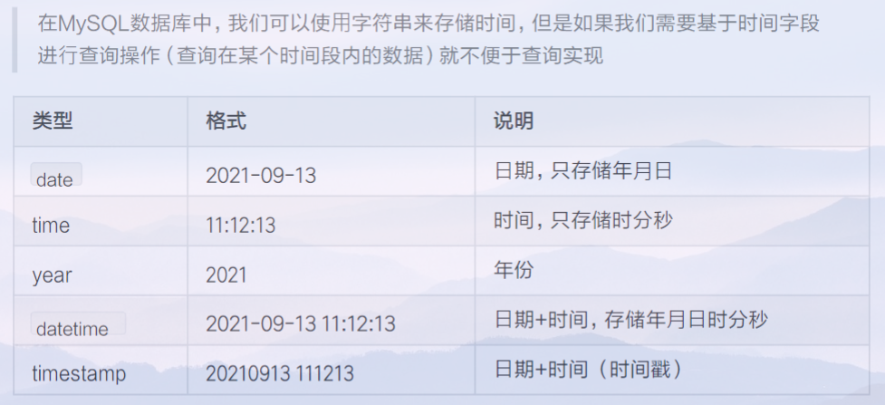

## 4-字段约束

* 非空约束（notnull）：限制此列的值必须提供，不能为null
* 唯一约束（unique）：在表中的多条数据，此列的值不能重复
* 主键约束（primarykey）：非空+唯一，能够唯一标识数据表中的一条数据
* 外键约束（foreignkey）：建立不同表之间的关联关系

```sql
## 字段约束
CREATE TABLE books(
	book_isbn char(4) PRIMARY key,
	book_name varchar(10) UNIQUE,
	book_author varchar(7) not null
	);

## 删除主键约束
ALTER TABLE books drop PRIMARY key;

## 添加主键约束
ALTER TABLE books MODIFY book_isbn char(4) PRIMARY key;

## 主键自动增长
CREATE TABLE types(
	type_id int PRIMARY key auto_increment,
	type_name varchar(20) not null
);

## 定义联合主键
CREATE TABLE grades(
	stu_num char(8),
	course_id int,
	score int,
	PRIMARY key(stu_num,course_id)
);
```

## 5-DML数据操纵语言

### 5.1-插入数据

```sql
## 插入数据
INSERT INTO students(stu_num,stu_name,stu_age,stu_gender,stu_tel,stu_qq)
VALUES('1001','张三',18,'男','12345678905','1234567890');
```

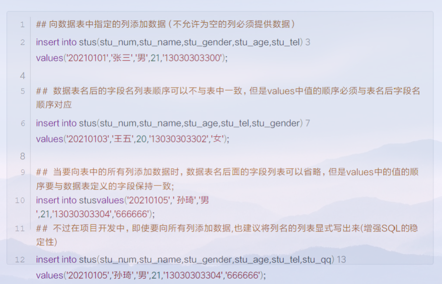

### 5.2-删除数据

```sql
## 删除数据
DELETE FROM students WHERE stu_num = '1001';
```

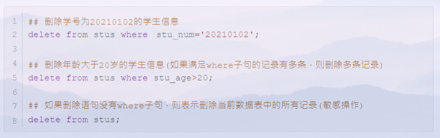

### 5.3-修改数据

```sql
## 修改数据
UPDATE students set stu_name = '李四' WHERE stu_num = '1001';
```

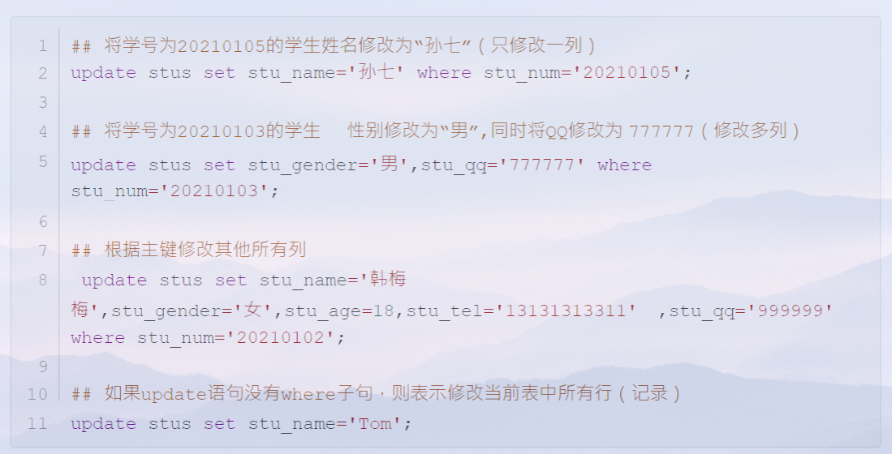

## 6-DQL数据查询语言

### 6.1-基础语法

```sql
## 基础语法
SELECT * from students;
SELECT stu_num,stu_name,stu_age FROM students;
```

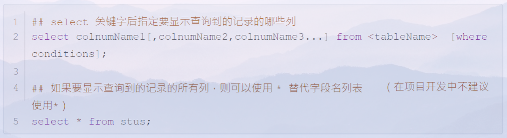

### 6.2-where 子句

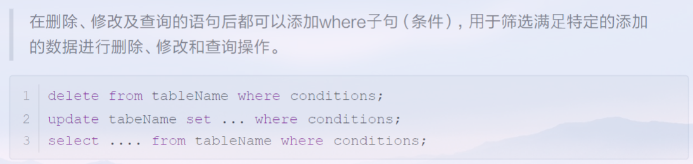

### 6.3-条件关系运算符

```sql
## 条件关系运算符
SELECT * FROM students WHERE stu_num = '1003';
SELECT * FROM students WHERE stu_age < 20;
## != 等价于 <>
SELECT * FROM students WHERE stu_name != '李四';
SELECT * FROM students WHERE stu_name <> '李四';
## BETWEEN AND
SELECT * FROM students WHERE stu_age BETWEEN 19 AND 20;
```

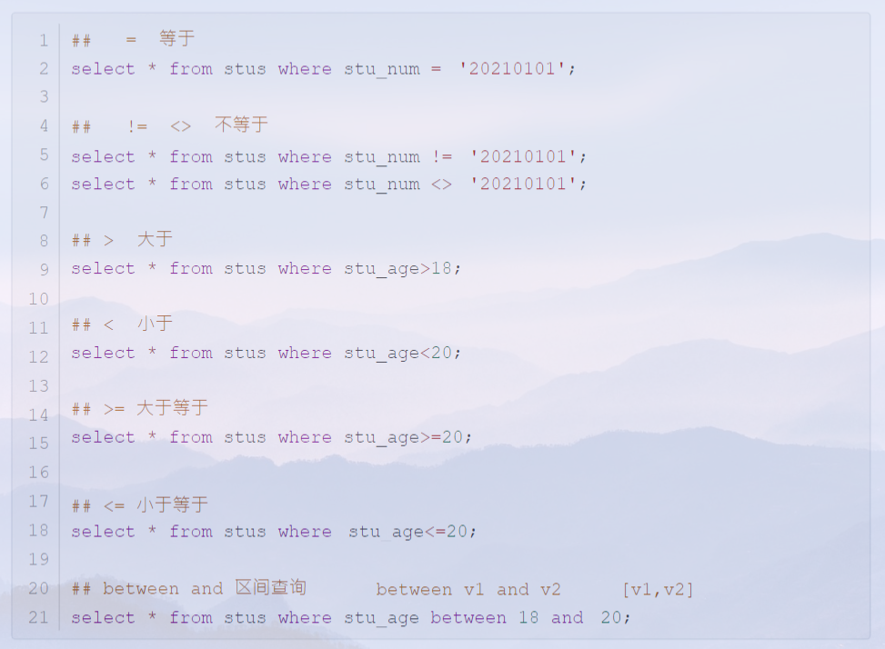

### 6.4-条件逻辑运算符

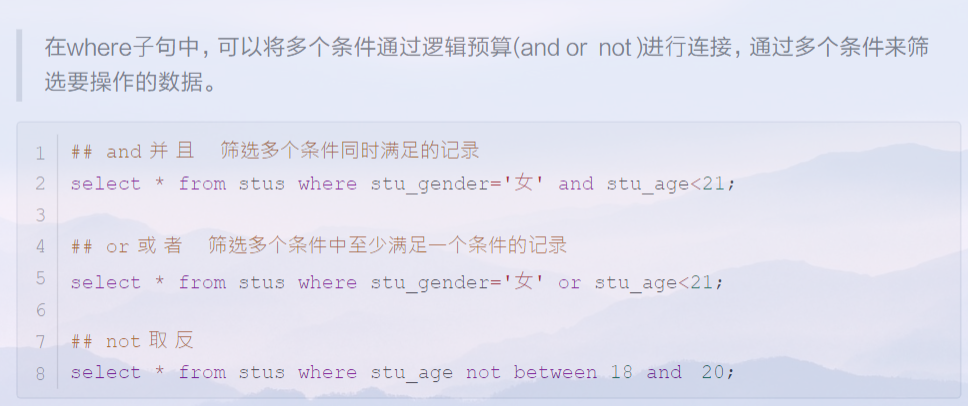

### 6.5-like语句

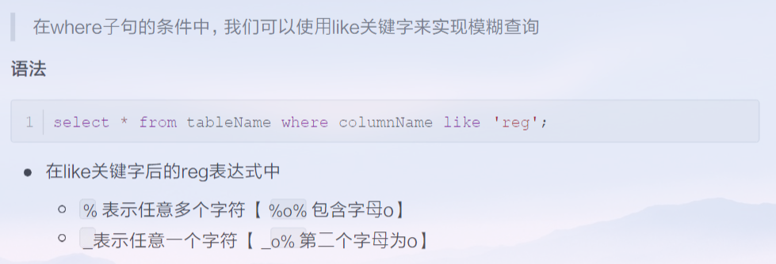

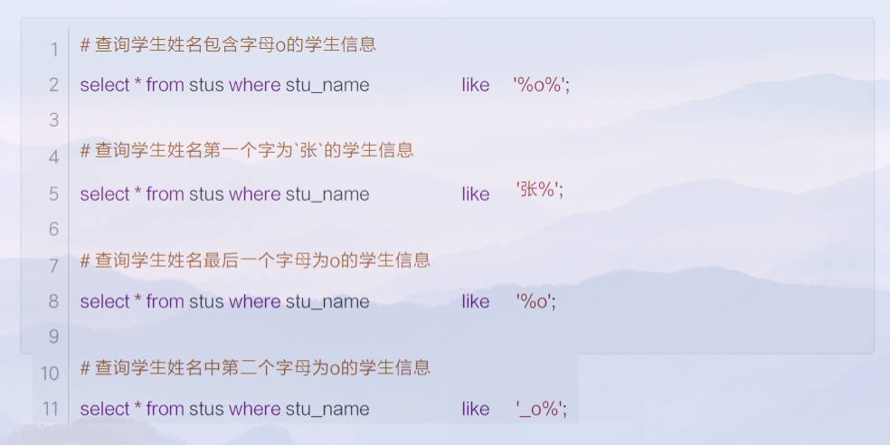

### 6.6-对查询结果的处理

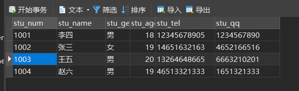

#### 6.6.1-设置查询的列

```sql
## 设置查询的列
SELECT stu_gender FROM students WHERE stu_age >= 18;
```

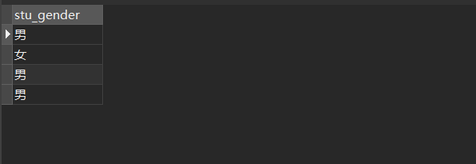

#### 6.6.2-计算列 & as 给列取名

```sql
## 计算列
SELECT stu_name,2022-stu_age AS 'stu_birth' FROM students;
```

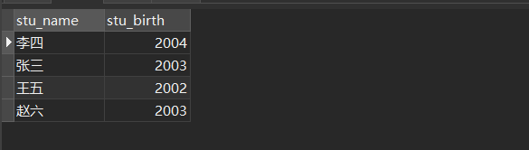

#### 6.6.3-distinct 消除重复行

```sql
## DISTINCT 消除重复行
SELECT DISTINCT stu_gender FROM students;
```

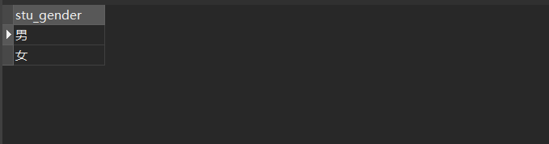

### 6.7-order by 排序

```sql
## ORDER BY 排序 升序
SELECT * FROM students ORDER BY stu_qq ASC;
```

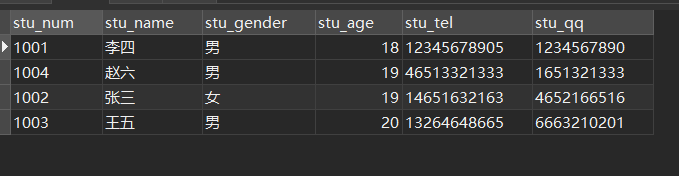

```sql
## ORDER BY 排序 降序
SELECT * FROM students ORDER BY stu_qq DESC;
```

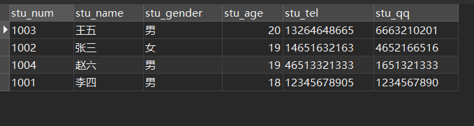

### 6.8-聚合函数

#### 6.8.1-统计函数 count()

统计函数，统计满足条件的指定字段值的个数（记录数）

```sql
## count()
SELECT COUNT(stu_num) FROM students WHERE stu_gender='男';
```

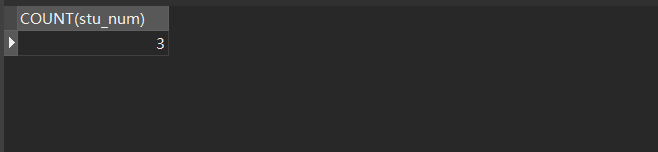

#### 6.8.2-计算最大值max()

计算最大值，查询满足条件的记录中指定列的最大值

```sql
## max()
SELECT MAX(stu_num) FROM students;
```

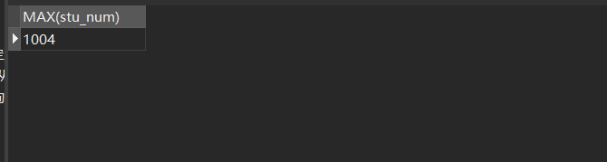

#### 6.8.3-计算最小值min()

计算最小值，查询满足条件的记录中指定列的最小值

```sql
## min()
SELECT min(stu_num) FROM students;
```

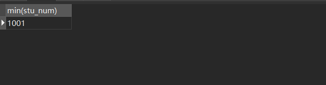

#### 6.8.4-求和函数sum()

计算和，查询满足条件的记录中指定的列的值的总和

```sql
## sum()
SELECT sum(stu_age) FROM students;
```

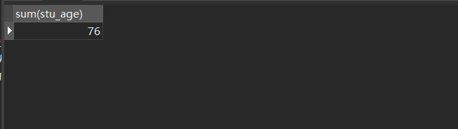

6.8.5-求平均值avg()

求平均值，查询满足条件的记录中计算指定列的平均值

```sql
## avg()
SELECT avg(stu_age) FROM students;

```

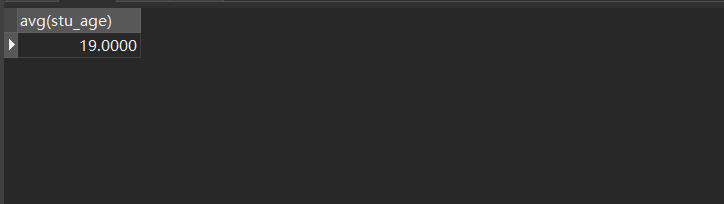

### 6.9-日期函数

```sql
## 日期函数
ALTER TABLE students add stu_date VARCHAR(200);
UPDATE students set stu_date = now() WHERE stu_gender='男';
UPDATE students set stu_date = SYSDATE() WHERE stu_gender='女';
```

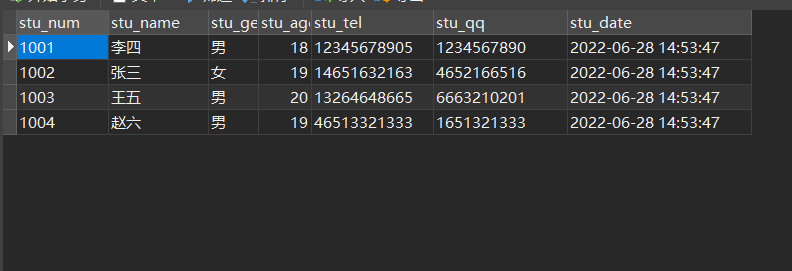

### 6.10-字符串函数

#### 6.10.1-拼接函数concat()

```sql
## CONCAT()
SELECT concat(stu_num,'-',stu_name,'-',stu_gender) AS 'concat()' FROM students;
```

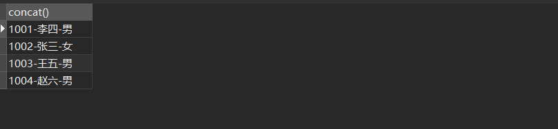

#### 6.10.2-转换大写upper()

```sql
## upper()
INSERT students(stu_num,stu_name,stu_gender,stu_age,stu_tel,stu_qq,stu_date) 
VALUE('1005','Alice','女',18,'15247856589','1625489953',SYSDATE());
SELECT UPPER(stu_name) FROM students WHERE stu_num='1005';
```

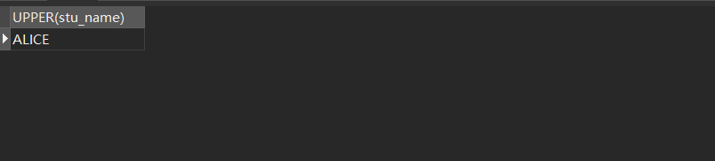

#### 6.10.3-转换小写lower()

```sql
## LOWER()
SELECT LOWER(stu_name) FROM students WHERE stu_num='1005';
```

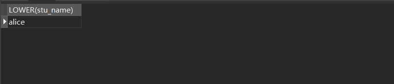

#### 6.10.4-字符串截取substr()

```sql
## SUBSTR()
SELECT SUBSTR(stu_name,1,1) AS 'substr()' FROM students;
```

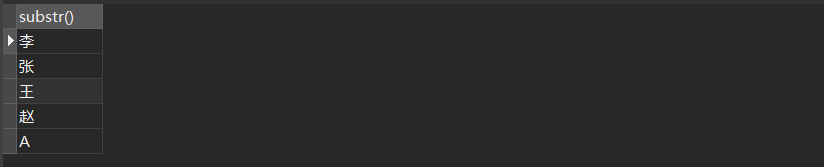

### 6.11-分组查询 group by

```sql
## 分组查询 GROUP BY
SELECT stu_gender as '性别',AVG(stu_age) as '平均年龄' FROM students GROUP BY stu_gender;
```


解释：先选择stu_gender和stu_age这两列，再按照不同的stu_gender分组（group by）最后计算平均数（avg）显示两列通过 as 重命名的列。

```sql
SELECT stu_age as '年龄',COUNT(stu_num) as '人数' FROM students GROUP BY stu_age;
```

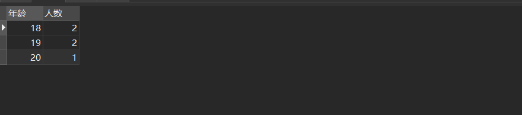

解释：先选择stu_age和stu_num(可以选择任意列用于求数量)，再通过stu_age分组，最后求出每一组的人数。

### 6.12-分页查询 limit


```sql
## 分页查询
INSERT students(stu_num,stu_name,stu_gender,stu_age,stu_tel,stu_qq,stu_date) 
VALUE('1006','Ben','男',21,'14526587462','1564872254',SYSDATE());

INSERT students(stu_num,stu_name,stu_gender,stu_age,stu_tel,stu_qq,stu_date) 
VALUE('1007','Catty','女',19,'15248554963','1472305564',SYSDATE());

INSERT students(stu_num,stu_name,stu_gender,stu_age,stu_tel,stu_qq,stu_date) 
VALUE('1008','Davie','男',20,'15247841023','1230045678',SYSDATE());

INSERT students(stu_num,stu_name,stu_gender,stu_age,stu_tel,stu_qq,stu_date) 
VALUE('1009','Eiddy','男',18,'14745694020','1234567025',SYSDATE());

SELECT * FROM students LIMIT 0,3;

SELECT * FROM students LIMIT 3,3;

SELECT * FROM students LIMIT 6,3;
```

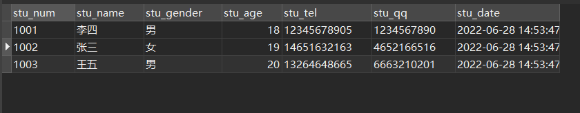

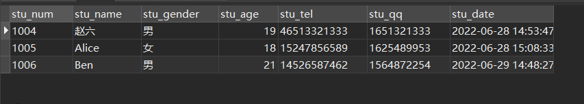

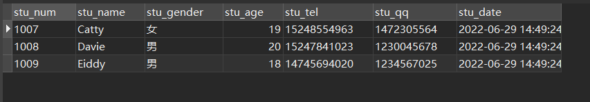


## 7-数据表的关联关系
